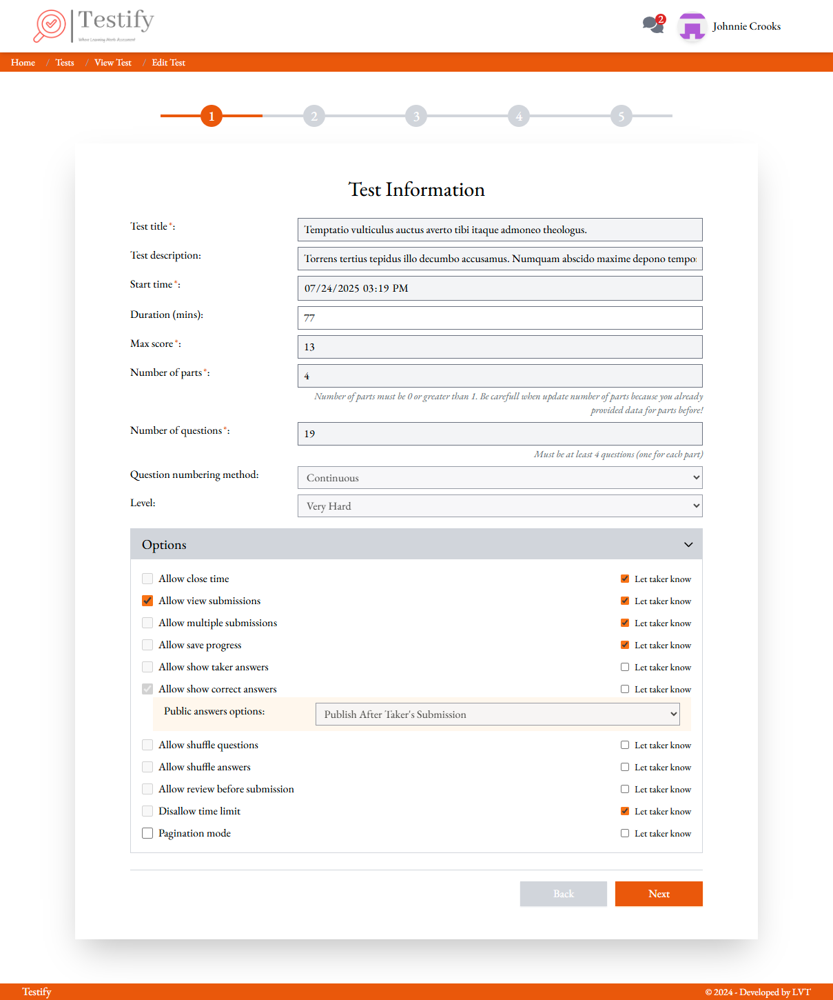
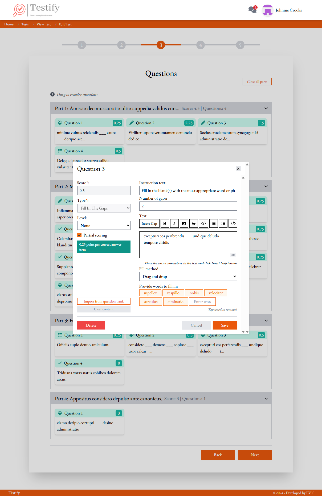
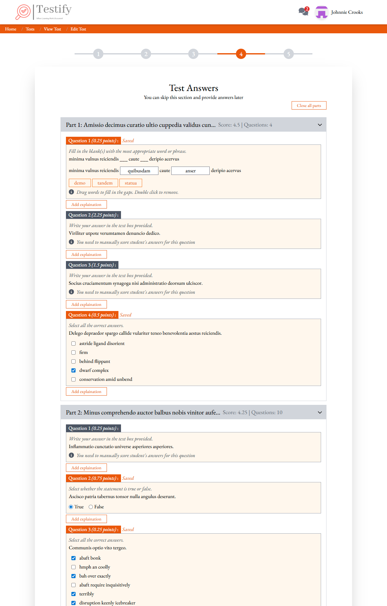
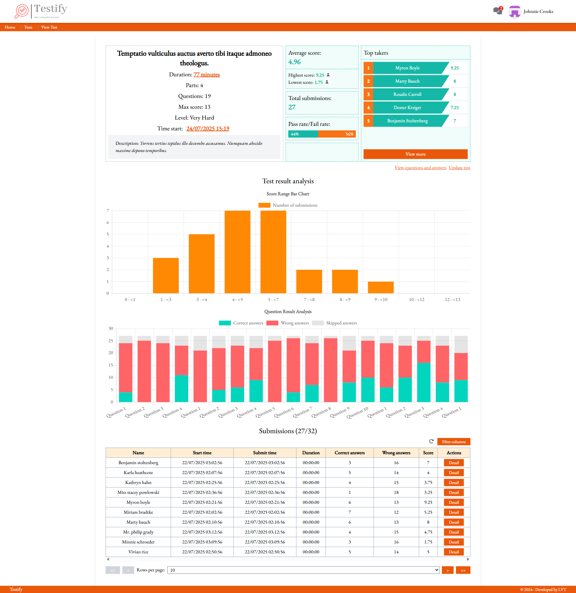
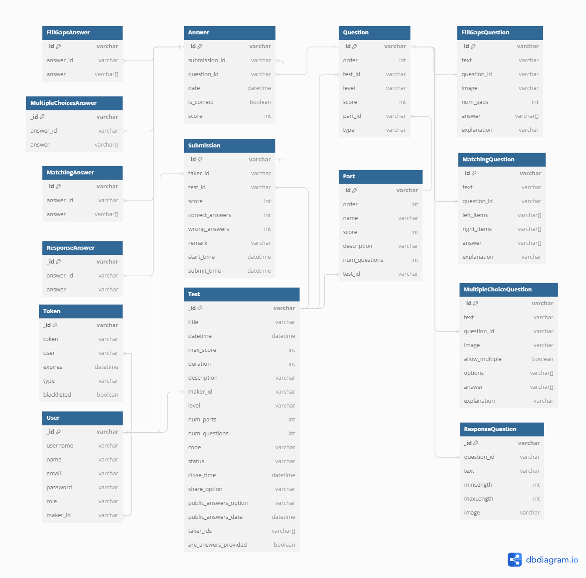

<a name="readme-top"></a>

<!-- PROJECT LOGO -->
<br />
<div align="center">
  <a href="https://github.com/levanthien1812/testify-web">
    
  </a>

  <h3 align="center">TESTIFY</h3>

  <p align="center">
    An easy-to-use website for making, managing, and taking tests, perfect
for teachers, students, and professionals.
    <br />
    <br />
    <a href="https://money-master-nine.vercel.app/">View Demo</a>
    ·
    <a href="https://github.com/levanthien1812/testify-web/issues">Report Bug</a>
    ·
    <a href="https://github.com/levanthien1812/testify-web/issues">Request Feature</a>
  </p>
</div>

<!-- ABOUT THE PROJECT -->

## About The Project

Welcome to the Test Creation Website project! This application is designed to streamline the process of creating, managing, and taking tests online. Whether you are an educator looking to create comprehensive assessments, a student preparing for exams, or a developer seeking a robust solution for test management, this platform offers a flexible and intuitive interface to meet your needs.

<p align="right">(<a href="#readme-top">back to top</a>)</p>

## Built With

-   React (Typescript)
-   Node.js
-   Express
-   MongoDB
-   Tailwind CSS
-   Socket IO

<p align="right">(<a href="#readme-top">back to top</a>)</p>

## Installation

1. Clone the repo:

```
 git clone https://github.com/levanthien1812/testify-web.git
```

2. Install dependencies:

```
   npm install
```

3. Run the server:

```
   npm start
```

## Usage

-   Visit `http://localhost:3001`
-   Create an account, verify your email and/or log in
-   Start creating tests!

<p align="right">(<a href="#readme-top">back to top</a>)</p>

## Environment Variables

Create a `.env` file in the root and add the following:

```
REACT_APP_API_HOST=your-api-host-here
REACT_APP_API_PORT=your-api-port-here
REACT_APP_API_PREFIX=your-api-prefix-here
REACT_APP_GOOGLE_CLIENT_ID=your-google-client-id-here
REACT_TIMEZONE=your-timezone-here
PORT=your-port-here
```

<p align="right">(<a href="#readme-top">back to top</a>)</p>

## 📸 Screenshots

### Create Test Page

<div style="display: flex; gap: 10px;">
  
  
  
</div>

### Test Report Page



## DB Diagram


